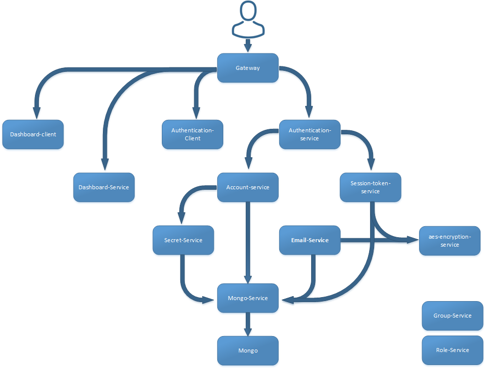

## ci-project
#### Index
* [1. Project-Definition](#1-Project-Definition)
* [2. Architecture](#2-Project-Architecture)
* [3. Dockerfiles ](#3-Dockerfiles-and-Images)
* [4. Docker-Compose ](#4-docker-compose)

### 1. Project Definition

The project invlove connection and automation of deployment of 14 microservices. The microservices itself are created to provide a secure login functionality with email verification. The microservices consists of:
* 10 Servcies: 
* 2 Frontend webpage application developed using vuejs.
* Gateway: For route trafficing and single point of entry which utilises the NGINX.
* 1 MongoDB for data persistance

### 2. Project Architecture
Diagram shown below illustrates the connections between all the ms. At the current stage the role-service and group-service are working components but they are not integrated into the system. Reading diagram from the bottom shows the dependecy of each microservice.


### 4. Dockerfiles and Images
Each folder contains a presetup Dockerfile which can be used to create docker images which are necessery to deploy the application. The application can be run by running all the images in the right order through utilisation of the project architecture. However as intial automation an docker-compose.yaml file was created which runs all the services in correct order. 

### 3. Setup

The following section will go through the process of setting up working enviroment and running the application on the linux machine.


First step is installtion of docker
```
curl https://get.docker.com | sudo bash
```
To operate docker without the need of sudo command add the permission to your user account
```
sudo usermod -aG docker $(whoami)
```
The application can be run just through docker. By building all the images with
```
docker build -t [provide a name for the image] .
```
and running them manully one by one using
```
docker run -d -p [PORT:PORT] --name [CONTEINER NAME] image-name
```
However to speed up the process you can just run the docker-compose.yaml file. To do that install docker install docker-compose by
```
sudo curl -L "https://github.com/docker/compose/releases/download/1.23.2/docker-compose-$(uname -s)-$(uname -m)" -o /usr/local/bin/docker-compose
```
to use the docker-compose you need to add yourself permissions by
```
sudo chmod +x /usr/local/bin/docker-compose
```
alter the ACTIVATION_IP environment variable to match your IP address
```
export ACTIVATION_IP= [your IP] 
```
run the .yaml (make sure you are in the GatewayProject directory)
```
docker-compose up -d
```
in a browser head to http://"your IP"/authentication/register and sign up

activate your account via the auto-sent email

head to http://"your IP"/authentication/login and login


### 5. Dockerhub
All the images are also avaiable through docker hub. To pull them from the repository use:
Some basic Git commands are:
```
docker pull [image-name]
docker pull maciejprzybylo95/mongo-service
```
* •	maciejprzybylo95/mongo-service
* •	maciejprzybylo95/aes-encryption-service
* •	maciejprzybylo95/email-service
* •	maciejprzybylo95/secret-service
* •	maciejprzybylo95/account-service
* •	maciejprzybylo95/session-token-service
* •	maciejprzybylo95/dashboard-service
* •	maciejprzybylo95/authentication-service
* •	maciejprzybylo95/dashboard-client
* •	maciejprzybylo95/authentication-client
* •	maciejprzybylo95/gateway
* •	maciejprzybylo95/role-service
* •	maciejprzybylo95/group-service

